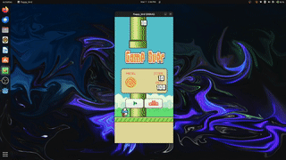

# Flappy Bird Clone



## Table of Contents

- [About the Project](#about-the-project)
- [Features](#features)
- [Getting Started](#getting-started)
  - [Prerequisites](#prerequisites)
  - [Installation](#installation)
- [Usage](#usage)
- [License](#license)
- [Acknowledgements](#acknowledgements)

## About the Project

I came up with the idea of making a clone of Flappy Bird to teach myself about the Godot Engine and how to utilize GDScript

## Features

- Simple and intuitive controls
- Procedurally generated pipes
- Score tracking
- Game over screen with option to restart

## Getting Started

### Prerequisites

To run this game, you need to have the Godot Engine installed on your computer. You can download it from the [official Godot website](https://godotengine.org/download).

### Installation

1. **Clone the repository:**
   ```sh
   git clone https://github.com/yourusername/flappy-bird-clone.git
   ```
    
1. Open the project in Godot:

2. Launch Godot.

3. Click on "Import" and navigate to the directory where you cloned the repository.
    

4. Select the project.godot file and open it.

### Usage
- Run the game: Click on the "Play" button in the Godot editor to start the game.
    - Controls:
        - Press the spacebar or click the mouse to make the bird flap its wings.
        - Dodge the pipes without hitting them to score points.

### License

Distributed under the MIT License. See [LICENSE](./LICENSE) for more information.

### Acknowledgements

[Godot Engine](https://godotengine.org)

[Flappy Bird](https://en.wikipedia.org/wiki/Flappy_Bird) by Dong Nguyen for the inspiration
